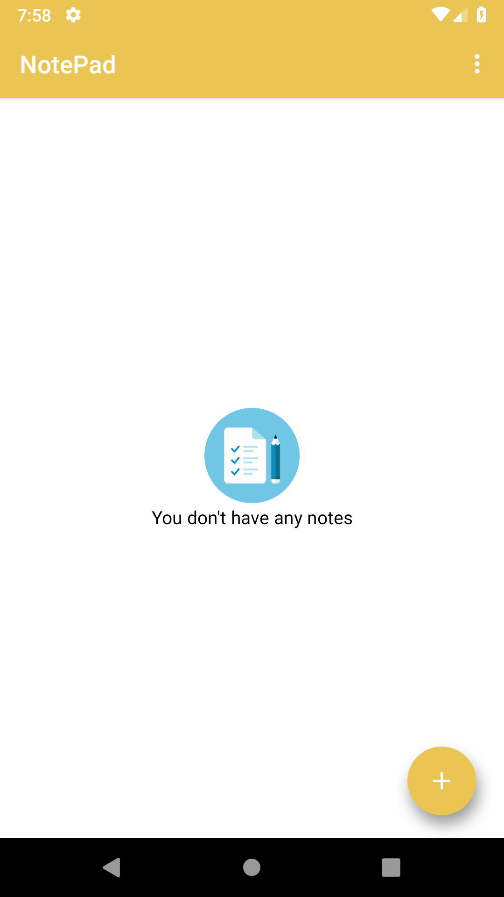
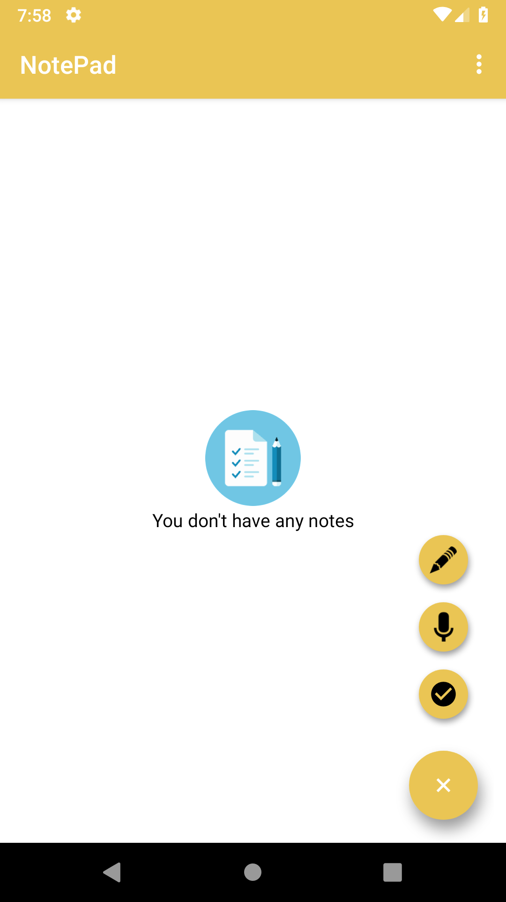
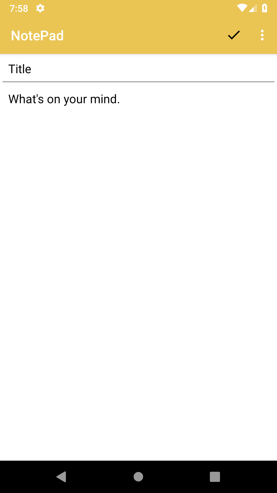
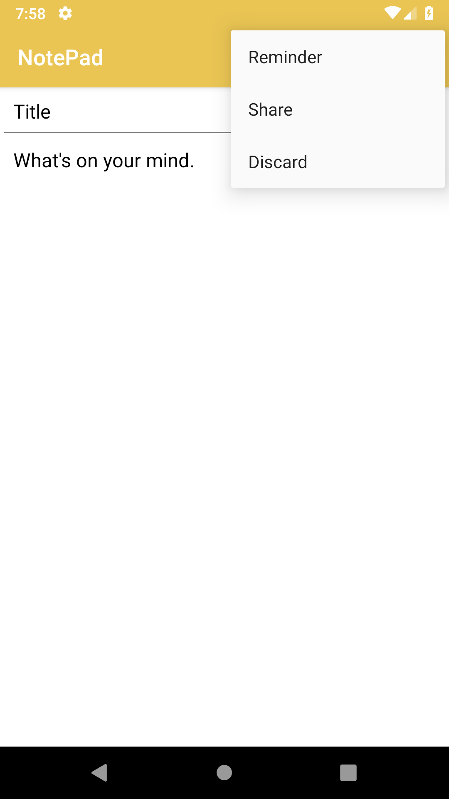
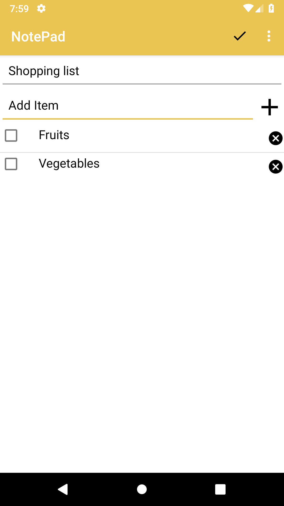
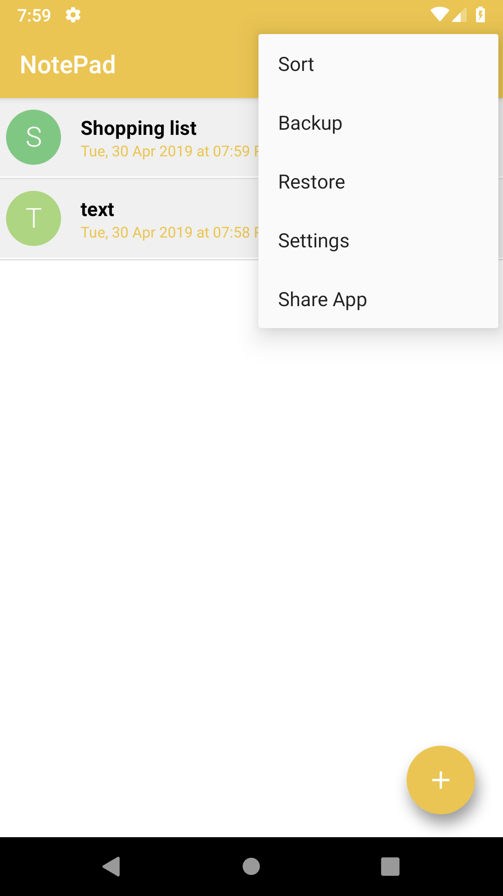
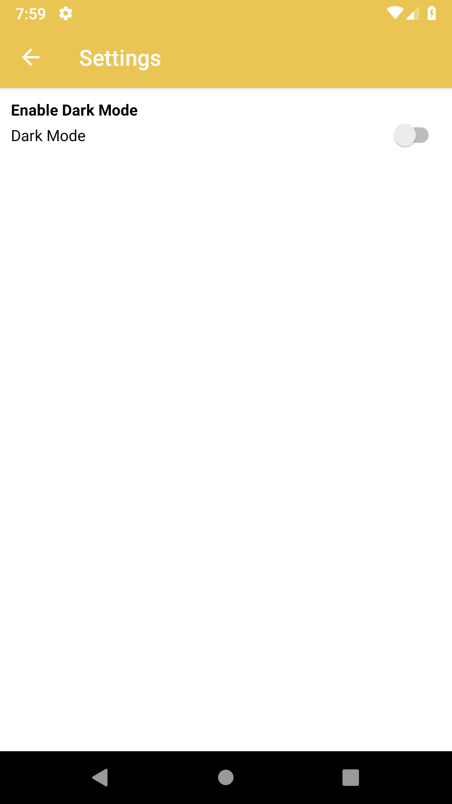
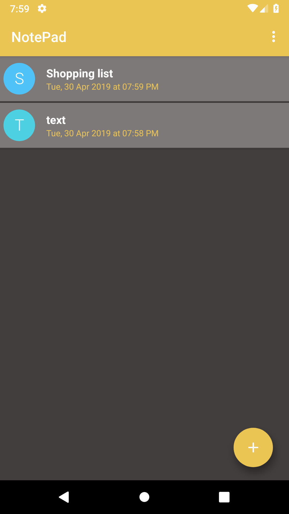

# Note Taking App
A simple notepad application where in you can save your notes, memos, e-mails etc.

#### Database Used: 
- Room DB
#### Libraries Used:
- Butterknife 
- Text Drawable (To show text on drawable)
- Circular Imageview
- Fab menu (To show different fab menu options)
#### Firebase:
- Analytics
- Crashanalytics

##### <b> Attaching some screenshots: </b> 

  
  
  
  

